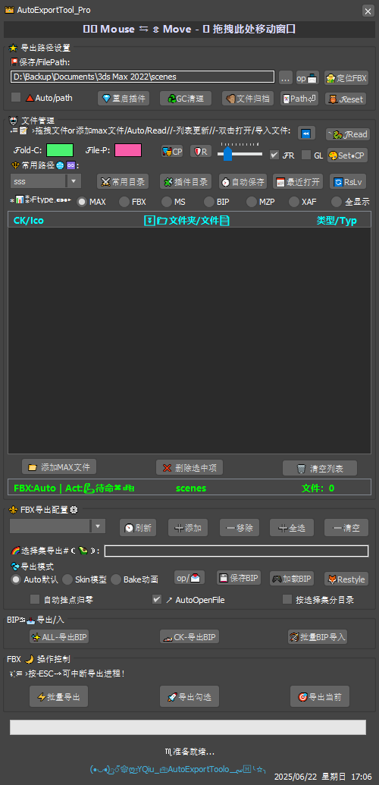

# 自定义设置指南

## UI个性化

pie
    title 自定义设置使用频率
    “颜色主题” ： 45
    “快捷键设置” ： 25
    “布局调整” ： 20
    “性能优化” ： 10
```

## 颜色配置
```maxscript
-- 颜色配置结构
struct colorConfig (
    folderNameColor = (dotNetClass "System.Drawing.Color").Yellow,
    fileNameColor = (dotNetClass "System.Drawing.Color").White
)

-- 应用新颜色
on btnApplyColor pressed do (
    g_ColorConfig.folderNameColor = cpFolder.color
    g_ColorConfig.fileNameColor = cpFile.color
    refreshFileListView()
)

-- 恢复默认
on btnResetColor pressed do (
    cpFolder.color = color 245 245 125
    cpFile.color = color 255 255 255
    applyColorSettings()
)
```

<div style="display:flex; gap:20px; margin:20px 0;">
  <div>
    
    <p align="center">默认配色</p>
  </div>
  <div>
    
    <p align="center">深色配色</p>
  </div>
</div>

## 布局调整

### 列表视图设置
```maxscript
-- 切换网格线显示
on chkGridLines changed state do (
    Lv_model.GridLines = state
    saveUIConfig()
)

-- 切换字体样式
on chkChangeFont changed state do (
    if state then
        Lv_model.Font = g_alternateFont
    else
        Lv_model.Font = g_defaultFont
    g_forceCustomLayout = state
    adjustColumnWidths forceCustom:state
)
```

### 响应式布局
```markdown
| 屏幕尺寸 | 布局模式 | 列宽比例 |
|----------|----------|----------|
| >1200px | 扩展模式 | 20%-60%-20% |
| 800-1200px | 标准模式 | 15%-65%-20% |
| <800px | 紧凑模式 | 10%-70%-20% |
```

## 性能优化
```maxscript
-- 虚拟滚动（大列表优化）
global g_PerfConfig = (
    maxRecentFiles: 10000,
    virtualScrollThreshold: 500
)

if Lv_model.Items.Count > g_PerfConfig.virtualScrollThreshold do (
    Lv_model.VirtualMode = true
    Lv_model.RetrieveVirtualItem += (fn sender e = (
        if e.ItemIndex < model_files_array.count then (
            e.Item = createLvItem model_files_array[e.ItemIndex]
        )
    ))
)

-- 文件监控优化
g_autoSaveWatcher.NotifyFilter = 
    (dotNetClass "System.IO.NotifyFilters").FileName OR
    (dotNetClass "System.IO.NotifyFilters").LastWrite
```

## 预设管理系统
```maxscript
-- 保存预设
fn savePreset presetName = (
    presetPath = getDir #plugcfg + "\\" + presetName + ".ini"
    setINISetting presetPath "Colors" "Folder" (cpFolder.color as string)
    setINISetting presetPath "Colors" "File" (cpFile.color as string)
    setINISetting presetPath "Layout" "GridLines" (chkGridLines.state as string)
)

-- 加载预设
fn loadPreset presetName = (
    presetPath = getDir #plugcfg + "\\" + presetName + ".ini"
    if doesFileExist presetPath do (
        col = execute (getINISetting presetPath "Colors" "Folder")
        if classOf col == Color do cpFolder.color = col
        -- ...其他设置加载
    )
)
```


