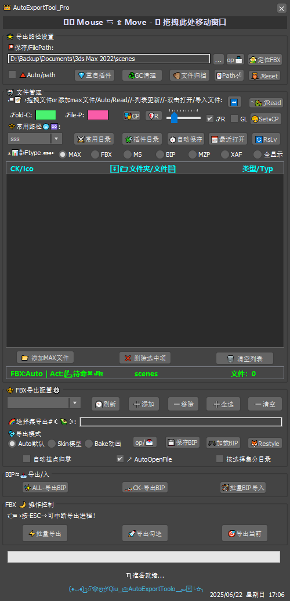
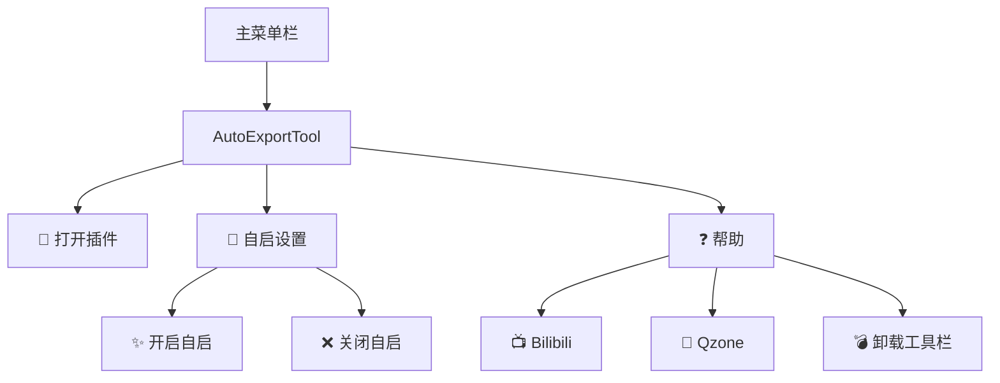

# 工具栏集成

## 工具栏布局
{ align=right width=300 }

AutoExportTool Pro 提供与 3ds Max 原生工具栏的无缝集成，让您快速访问核心功能：



## 安装与配置

### 手动添加工具栏
```maxscript
macroScript OpenToolAction 
    category:"AutoExportTool" 
    buttonText:"🧰​AutoExportTool"
(
    fileIn "AutoExportTool_Pro.ms"
    createDialog AutoExportTool_Pro
)
```

### 自动安装（推荐）
```maxscript
fn addToolbarToMax = (
    -- 创建菜单结构
    mainMenu = menuMan.getMainMenuBar()
    subMenu = menuMan.createMenu "AutoExportTool"
    
    -- 添加菜单项
    openItem = menuMan.createActionItem "OpenToolAction" "AutoExportTool"
    subMenu.addItem openItem -1
    
    -- 添加到主菜单栏
    mainItem = menuMan.createSubMenuItem "🧰​AutoExportTool" subMenu
    mainMenu.addItem mainItem (mainMenu.numItems() + 1)
    
    -- 更新界面
    menuMan.updateMenuBar()
)
```

### 卸载工具栏
```maxscript
fn removeToolbarFromMax = (
    mainMenu = menuMan.getMainMenuBar()
    subMenu = menuMan.findMenu "AutoExportTool"
    
    if subMenu != undefined do (
        menuMan.unRegisterMenu subMenu
        menuMan.updateMenuBar()
        messageBox "工具栏已成功移除" title:"成功"
    )
)
```

## 自启动配置

### 启用自启动
```maxscript
on enableAutoStart pressed do (
    startupScript = getDir #userStartupScripts + "\\FBX_ExporTools_AutoStart.ms"
    scriptContent = "try (fileIn @\" + g_pluginPath + "\"; createDialog AutoExportTool_Pro) catch()"
    
    f = createFile startupScript
    format "%" scriptContent to:f
    close f
)
```

### 禁用自启动
```maxscript
on disableAutoStart pressed do (
    startupScript = getDir #userStartupScripts + "\\FBX_ExporTools_AutoStart.ms"
    if doesFileExist startupScript do deleteFile startupScript
)
```

## 自定义菜单项
```markdown
| 菜单项 | 标识符 | 功能描述 |
|--------|--------|----------|
| 🧰​AutoExportTool | OpenToolAction | 打开主界面 |
| ✨ 开启自启 | AutoStartEnableAction | 启用插件自启动 |
| ❌ 关闭自启 | AutoStartDisableAction | 禁用插件自启动 |
| 📺 Bilibili | BilibiliAction | 打开B站主页 |
| 🐧 Qzone | QQSpaceAction | 打开QQ空间 |
| 💣 卸载工具栏 | RemoveToolbarAction | 完全移除工具栏 |
```

<video controls width="100%">
  <source src="../videos/toolbar_setup.mp4" type="video/mp4">
  您的浏览器不支持视频标签
</video>
