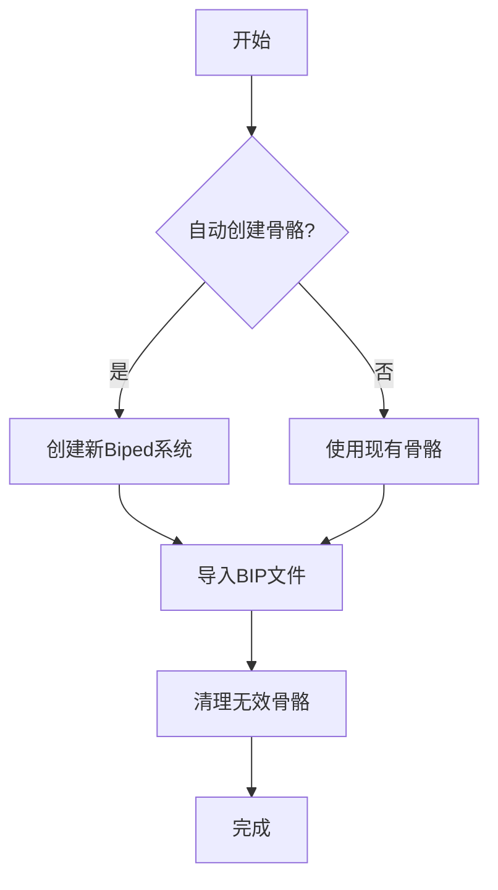

# BIP动作管理系统

## 功能演示


## 核心操作

### 1. 批量导出BIP
```maxscript
fn batchExportBip files = (
    for f in files do (
        if loadMaxFile f quiet:true do (
            bipRoot = getBipedRoot()
            if isValidNode bipRoot do (
                outPath = bipExportPath + "\\" + (getFilenameFile f) + ".bip"
                biped.saveBipFile bipRoot.controller outPath
            )
            resetMaxFile #noPrompt
        )
    )
)
```

### 2. 批量导入BIP


### 3. 高级选项
```maxscript
-- 版本兼容处理
global g_bipImportVersion = case (maxVersion())[1] of (
    24000: #2024
    23000: #2023
    -- ...
)

-- 进度监控
g_bipProgressTimer = dotNetObject System.Windows.Forms.Timer
dotNet.addEventHandler g_bipProgressTimer Tick (fn updateProgress = (...))
```

## 使用场景
| 场景 | 推荐操作 | 注意事项 |
|------|----------|----------|
| 角色动画迁移 | 批量导出BIP + 一键换皮 | 确保骨骼结构一致 |
| 动作库制作 | 批量导入BIP | 开启"自动创建骨骼" |
| 多角色动画 | 批量导出后分别导入 | 注意角色比例差异 |
```

#### 自定义设置 (`docs/advanced/customization.md`)
````markdown
# 自定义设置指南

## UI个性化


```maxscript
-- 颜色配置结构
struct colorConfig (
    folderNameColor = (dotNetClass "System.Drawing.Color").Yellow,
    fileNameColor = (dotNetClass "System.Drawing.Color").White
)

-- 应用新颜色
on btnApplyColor pressed do (
    g_ColorConfig.folderNameColor = cpFolder.color
    g_ColorConfig.fileNameColor = cpFile.color
    refreshFileListView()
)
```

## 快捷键设置
```markdown
| 功能 | 默认快捷键 | 自定义方法 |
|------|------------|------------|
| 刷新列表 | F5 | `Lv_model.KeyDown` 事件处理 |
| 重命名 | F2 | 编辑`initKeyboardEvents`函数 |
| 批量导出 | Ctrl+E | 修改`rollout`事件绑定 |
```

## 性能优化
```maxscript
-- 虚拟滚动（大列表优化）
if Lv_model.Items.Count > g_PerfConfig.virtualScrollThreshold do (
    Lv_model.VirtualMode = true
    Lv_model.RetrieveVirtualItem += (fn ...)
)

-- 文件监控优化
g_autoSaveWatcher.NotifyFilter = (dotNetClass "System.IO.NotifyFilters").FileName
g_autoSaveWatcher.Filter = "*.max"
```

## 主题切换
```markdown
<div style="display:flex">
  
  
</div>
```

