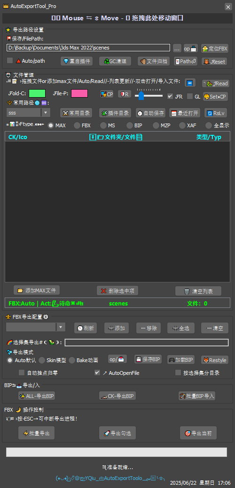

# FBX导出系统

## 三种导出模式


### 1. Auto默认模式
```maxscript
export_mod_fn 1  -- Auto模式
/* 参数配置：
- 自动检测场景内容
- 智能优化导出设置
- 平衡文件大小和质量
*/
```

### 2. Skin模型模式
```maxscript
export_mod_fn 2  -- Skin模式
/* 参数配置：
FbxExporterSetParam "Skin" true
FbxExporterSetParam "Animation" false
FbxExporterSetParam "SmoothingGroups" true
*/
```

### 3. Bake动画模式
<video controls width="80%">
  <source src="../videos/bake_export.mp4" type="video/mp4">
  您的浏览器不支持视频标签
</video>

```maxscript
export_mod_fn 3  -- Bake模式
/* 参数配置：
FbxExporterSetParam "BakeAnimation" true
FbxExporterSetParam "BakeResampleAnimation" true
FbxExporterSetParam "FilterKeyReducer" true
*/
```
导出动画详细参数设置 （FX 函数 参考 ）
-- 强化动画检测-函数
fn export_mod_fn mod_state = (
    --
    case mod_state of (
        1: ( -- Auto模式（智能判断）
            FbxExporterSetParam "ResetExport"
            FbxExporterSetParam "SmoothingGroups" true
            FbxExporterSetParam "SmoothMeshExport" true
            
            FbxExporterSetParam "Cameras" false
            FbxExporterSetParam "Lights" false
            FbxExporterSetParam "EmbedTextures" false
            FbxExporterSetParam "ShowWarnings" false
        )
        2: ( -- Skin模型模式
            FbxExporterSetParam "ResetExport"
            FbxExporterSetParam "SmoothingGroups" true
            FbxExporterSetParam "SmoothMeshExport" true
            FbxExporterSetParam "Animation" false
            FbxExporterSetParam "EmbedTextures" false
            FbxExporterSetParam "Cameras" false
            FbxExporterSetParam "Lights" false
            FbxExporterSetParam "Skin" true -- 显式启用蒙皮
            FbxExporterSetParam "ShowWarnings" false
        )
        3: ( -- Bake动画模式
            FbxExporterSetParam "ResetExport"
            FbxExporterSetParam "SmoothingGroups" false
            FbxExporterSetParam "SmoothMeshExport" false
            
            FbxExporterSetParam "Animation" true
            FbxExporterSetParam "BakeAnimation" true
            FbxExporterSetParam "BakeResampleAnimation" true
            FbxExporterSetParam "FilterKeyReducer" true
            
            FbxExporterSetParam "EmbedTextures" false
            FbxExporterSetParam "Cameras" false
            FbxExporterSetParam "Lights" false
            FbxExporterSetParam "ShowWarnings" false
        )
    )
        
)
## 批量导出流程
```mermaid
sequenceDiagram
    participant 用户
    participant 插件
    participant 3ds Max
    用户->>插件: 选择导出模式
    用户->>插件: 设置输出路径
    插件->>3ds Max: 准备导出配置
    循环 文件列表
        插件->>3ds Max: 加载.max文件
        3ds Max->>插件: 返回场景数据
        插件->>3ds Max: 应用导出设置
        3ds Max->>文件系统: 生成FBX文件
    end
    插件->>用户: 显示完成报告
```

## 高级功能
```maxscript
-- 按选择集分目录导出
if auto_makedir_set.checked do (
    for set in export_setsets do (
        setDir = outputPath + "\\" + set
        makeDir setDir
        exportSelectedSet set setDir
    )
)

-- 挂点归零技术
目前 的 挂点  默认为 xyz 归零 ，旋转 X : 90 ,Y : 0,Z : 0  (注意！是 view轴 )
if auto_socket.checked do (
    for obj in selection where classOf obj == Dummy do (
        obj.pos = [0,0,0]
        
    if chk_rotation.checked do (
        -- 确保使用Euler XYZ控制器
                if chk_euler.checked and classOf obj.rotation.controller != Euler_XYZ then (
                    obj.rotation.controller = Euler_XYZ()
                )
                
                obj.rotation.controller.x_rotation = 90
                obj.rotation.controller.y_rotation = 0
                obj.rotation.controller.z_rotation = 0
            )
    
    )
)
```

